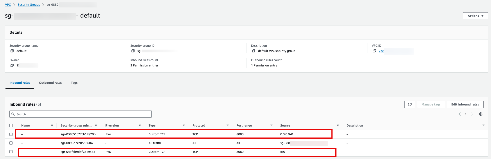

This project is an experimentation to create a simplified threat detection solution.

```bash
go work init ./shared ./camera-stream-capturer 
```

To add new modules:

```bash
go work edit -use ./alert-notifier 
```

To drop modules:

```bash
go work edit -dropuse ./alert-notifier 
```

## Run Locally

To run locallY using one terminal session:

```bash
make start
```
To stop a locallY running instance using another terminal session:

```bash
./stop
```

**Please note** that I am using DAPR to orchestrate locally. So instead of using something like Docker compose (which requires that I Dockerize everything), DAPR provides an easy way to start all Microservices. This works even if the runtime mode is set to use `aws`.

## Redis

Start Local REDIS container:

```bash
docker exec -it dapr_redis redis-cli
```

## SQLLite

```bash
brew install sqlite3
brew install sqlite-utils
```

[https://earthly.dev/blog/golang-sqlite/](https://earthly.dev/blog/golang-sqlite/)
[https://www.allhandsontech.com/programming/golang/how-to-use-sqlite-with-go/](https://www.allhandsontech.com/programming/golang/how-to-use-sqlite-with-go/)

## Cleanup

To cleanup all resources in `Redis`:

```bash
FLUSHALL
```

To cleanup all resources in `SQLLite`:

```bash
cd <project-root>/db
rm clips.db
```

To cleanup all resources in `AWS S3`, login to the console portal and cleanup bucket items ma manually.

## Dockerize

*Because the solution is a Go workspace and relies on a shared library, it is important to tag the shared lib and update the microservice modules.*

- Merge and tag shared lib (`threat-detection-shared`) i.e. `v1.0.0`:
    - Assuming we have a working branch i.e. `my-branch`
    - `git add --all`
    - `git commit -am "Major stuff..."`
    - `git push`
    - `git checkout main`
    - `git merge my-branch`
    - `git tag -a v1.0.0 -m "my great work"`
    - `git tag` to make sure is is created.
    - `git push --tags` to push tags to Github.
- In each microservice folder, perform the following to update the shared library:
    - `go get -u github.com/khaledhikmat/threat-detection-shared@v1.0.0`. Replace `v1.0.0` with your actual tag.
    - `go mod tidy`
- `make dockerize`. This buildsand dockerizes all microservices.
- `make push-2-hub`. This builds, dockerizes and pushes microservice Docker images to a public Docker repo i.e. Docker Hub.
- Merge and tag as above.

**Please note** that:
- Sometimes `make push-2-hub` times out! In this case, you have to execute the command one by one 😢.  
- The image names must be formatted this way: `<accountname>/<image-name>:tag`.
- The image architecture must be `linux/amd64`. So if you are on MacOS M1/M2 chip, you must instruct Docker to build using amd64 platform: `buildx build --platform linux/amd64`.

## Environment Variables

There are two runtime environments:
- `local`: used for laptop deployment. `dapr.yaml` is used to define all the microservices that must run.
- `higher`: used for Cloud deployment. Microservices are expected to run within Docker containers.  

There are two runtime modes:
- `dapr`: uses DAPR components and local Docker containers (such as Redis and Redis Streams) to provide functionality for storage (i.e. REDIS), pubsub (i.e. REDID Streams) and persistence (i.e. REDIS and SQLLite). 
- `aws`: uses AWS services to ptovide such as SQS, SNS and S3 to provide functionality for storage (i.e. S3), pubsub (i.e. SNS and SQS) and persistence (i.e. AWS OpenSearch and SQLLite).

**Please note** that:
- While running locally, `dapr.yml` is used to define microservices that must be launched regardless of whether the runtime mode is `dapr` or `aws`.
- Some env variables are specified in `dapr.yml` file while others (that expose account information) are stored in `.env` file. The `.env` file is added to `.gitgignore` so it is not pushed to source control.

The following are the required env variables for each microservice:

### Camera Stream Capturer

| VAR | DESC | DEFAULT |
| --- | --- | --- |
| `RUN_TIME_ENV` | some desc | `local` |
| `RUN_TIME_MODE` | some desc | `aws` |
| `OTEL_PROVIDER` | some desc | `aws` |
| `AWS_ACCESS_KEY_ID` | some desc | `personal AWS account` |
| `AWS_SECRET_ACCESS_KEY` | some desc | `personal AWS account` |
| `AGENT_MODE` | some desc | `files` |
| `AGENT_RECORDINGS_FOLDER` | some desc | `./data/recordings` |
| `AGENT_SAMPLES_FOLDER` | some desc | `./data/samples` |
| `CAPTURER_MAX_CAMERAS` | some desc | `3` |

### Model Invoker

There can be several deployments of this Microservice so we can invoke all the models that we have (or will have):
- `weapon`
- `fire`
- `crowd`
- etc. 

The `AI_MODEL` specifies the type.

| VAR | DESC | DEFAULT |
| --- | --- | --- |
| `RUN_TIME_ENV` | some desc | `local` |
| `RUN_TIME_MODE` | some desc | `aws` |
| `OTEL_PROVIDER` | some desc | `aws` |
| `AWS_ACCESS_KEY_ID` | some desc | `personal AWS account` |
| `AWS_SECRET_ACCESS_KEY` | some desc | `personal AWS account` |
| `AI_MODEL` | some desc | `weapon` |
| `INVOKER_METHOD` | some desc | `api` |

### Media Indexer

There can be several deployments of this Microservice so we can index to the destinations that we need:
- `database`
- `elastic`
- etc. 

The `MEDIA_INDEXER_TYPE` specifies the media indexer type while the `INDEXER_TYPE` specifies the actual implementation.

| VAR | DESC | DEFAULT |
| --- | --- | --- |
| `RUN_TIME_ENV` | some desc | `local` |
| `RUN_TIME_MODE` | some desc | `aws` |
| `OTEL_PROVIDER` | some desc | `aws` |
| `AWS_ACCESS_KEY_ID` | some desc | `personal AWS account` |
| `AWS_SECRET_ACCESS_KEY` | some desc | `personal AWS account` |
| `SQLLITE_FILE_PATH` | some desc | `/Users/khaled/github/threat-detection/db/clips.db` |
| `OPEN_SEARCH_DOMAIN_ENDPOINT` | some desc | `https://<your-domain>.aos.us-east-2.on.aws` |
| `OPEN_SEARCH_INDEX_NAME` | some desc | `<your-index-name>` |
| `OPEN_SEARCH_USERNAME` | some desc | `<your-master-username>` |
| `OPEN_SEARCH_PASSWORD` | some desc | `<your-master-password>` |
| `MEDIA_INDEXER_TYPE` | some desc | `elastic` |
| `INDEXER_TYPE` | som desc | `opensearch` |

### Media API

| VAR | DESC | DEFAULT |
| --- | --- | --- |
| `RUN_TIME_ENV` | some desc | `local` |
| `RUN_TIME_MODE` | some desc | `aws` |
| `OTEL_PROVIDER` | some desc | `aws` |
| `AWS_ACCESS_KEY_ID` | some desc | `personal AWS account` |
| `AWS_SECRET_ACCESS_KEY` | some desc | `personal AWS account` |
| `SQLLITE_FILE_PATH` | some desc | `/Users/khaled/github/threat-detection/db/clips.db` |
| `OPEN_SEARCH_DOMAIN_ENDPOINT` | some desc | `https://<your-domain>.aos.us-east-2.on.aws` |
| `OPEN_SEARCH_INDEX_NAME` | some desc | `<your-index-name>` |
| `OPEN_SEARCH_USERNAME` | some desc | `<your-master-username>` |
| `OPEN_SEARCH_PASSWORD` | some desc | `<your-master-password>` |
| `INDEXER_TYPE` | som desc | `opensearch` |
| `APP_PORT` | som desc | `8080` |

### Alert Notifier

There can be several deployments of this Microservice so we can invoke all the upstream application we need to notify:
- `ccure`
- `slack`
- `snow`
- `perspective`
- etc. 

The `ALERT_TYPE` specifies the type.

| VAR | DESC | DEFAULT |
| --- | --- | --- |
| `RUN_TIME_ENV` | some desc | `local` |
| `RUN_TIME_MODE` | some desc | `aws` |
| `OTEL_PROVIDER` | some desc | `aws` |
| `AWS_ACCESS_KEY_ID` | some desc | `personal AWS account` |
| `AWS_SECRET_ACCESS_KEY` | some desc | `personal AWS account` |
| `ALERT_TYPE` | some desc | `snow` |

## Observability

In this POC, we are using [OpenTelemetry](https://opentelemetry.io/) to push traces, metrics and logs to observability backend such as [AWS XRay](https://aws-otel.github.io/) or others. Of course, OpenTelemetry provides many advantages.

OpenTelemetry requires that we have a collector to ingest telemetry signals and export them to different backend systems. If we are running locally, we can run an [AWS Distro OpenTelemetry](https://aws-otel.github.io/) Docker container that acts as a Daemon service for our local microservices.

However, if we are running in ECS, for example, we can inject an AWS collector as a side car in our task definitions.

Let us see how we cn enable OpenTelemery in both environment. 

### Local

Steps to run ADOT collector locally:

- Make sure the following env vars are set:

```bash
export AWS_REGION="us-east-2"
export AWS_ACCESS_KEY_ID="<key>"
export AWS_SECRET_ACCESS_KEY="<key>"
```

- Check to make sure you see all the env vars above:

```bash
env
```

- In one terminal session, run the AWS collector: 

```bash
make run-aws-collector
```

- To stop the AWS collector:

```bash
make stop-aws-collector
```

**Please note** the AWS collector local configuration file is at `./telemetry/aws-collector-config.yaml`.

### ECS

There are two options:
- Side Car
- Daemon service

I opted for side car approach. So the basic idea is that the AWS collector will be added as a side car to every container we deploy. To do this, [task definitions](#task-definitions) configure extra container to run the AWS collector. AWS provides a sample of how to do this [here](https://aws-otel.github.io/docs/setup/ecs/task-definition-for-ecs-fargate). 

## Deployment

AWS is the only Cloud vendor we are considering at this time for this solution. The below show a manual deployment. But we need to work on CLI pipeline to push these resources to AWS.

### Storage

Buckets in S3 are created automatically as needed. There is a bucket for each camera. To make things easier to watch video in browser, I made buckets accessible publicly by changing bucket permissions to un-block public access and adding a permission policy:

```json
{
  "Version":"2012-10-17",
  "Statement":[
    {
      "Sid":"AddPublicReadAccess",
      "Effect":"Allow",
      "Principal": "*",
      "Action":["s3:GetObject"],
      "Resource":["arn:aws:s3:::your-bucket-name/*"]
    }
  ]
}
```

### SQS and SNS

In local mode, SNS topics and SQS queues are automatically created if they do not exist. So when we deploy to AWS, we expect these resources to be created. 

User needs SNS and SQS full access permissions attached.

### OpenSearch Service

A domain (cluster + index) needs to be created ahead of deployment. Some of the env variables below rely on OpenSearch being available.

Domain: `clips`

Please note the following:
- The domain name should be the index name i.e. `clips`. It does not need to be unique as I originally thought. It seems AWS generates a random number to guarantee uniqueness i.e.:
`https://clips-63lttw4itao7padfajs4qez3ne.aos.us-east-2.on.aws`
- Domain Creation Method: `Standard Create`
- Templates: `Dev/Test`
- Deployment Option: `Domain without standby` 
- Avalilability Zone: `1-AZ` 
- Data Nodes: smallest
- Number of Nodes: 1
- Storage Type: `EBS`
- Network: Public Access
- Dual-stack mode 
- Enable Fine-grained access control
- Create Master User
- Access Policy: configure domain level access policy
- Visual Editor: Change Action to `Allow` 
- Once the domain gets created, make sure the domain security policy has `allow` access:

```json
{
  "Version": "2012-10-17",
  "Statement": [
    {
      "Effect": "Allow",
      "Principal": {
        "AWS": "*"
      },
      "Action": "es:*",
      "Resource": "arn:aws:es:us-east-2:997763366404:domain/clips/*"
    }
  ]
}
```

- Once you want to start exploring data in OpenSearch dashboard, you will have to create index pattern. There you decide the field that should be considered as a timestamp. In our case, the `indexTime` field is probably a good choice. This allows you to do time-based searches.  
- Must change the mapping on the `region` field to make it indexable so we can search on it. This can be done by sending a `put` mapping request from OpenSearch dev tool like so:

```json
PUT /clips/_mapping
{
  "properties": {
    "region": {
      "type": "text",
      "fielddata": true
    }
  }
}
```

#### Useful Queries

Here are some useful aggregation queries against OpenSearch to help demonstrate query power. These can be run using the dev tools in OpenSearch management:

- Match all records and return a single-valued metric aggregation for the sum of all alerts:

*Request*

```json
GET /clips/_search
{
  "query": {
    "match_all": {}
  },
  "size": 0, 
  "aggs": {
    "alerts_sum": {
      "sum": {
        "field": "alertsCount"
      }
    }
  }
}
```

*Response*

```json
{
  "took": 5,
  "timed_out": false,
  "_shards": {
    "total": 5,
    "successful": 5,
    "skipped": 0,
    "failed": 0
  },
  "hits": {
    "total": {
      "value": 12,
      "relation": "eq"
    },
    "max_score": null,
    "hits": []
  },
  "aggregations": {
    "alerts_sum": {
      "value": 3
    }
  }
}
```

- Match documents for `camera1` and return single-valued metric aggregation for the average number of frames:

*Request*

```json
GET /clips/_search
{
  "query": {
    "match": {
      "camera": "camera1"
    }
  },
  "size": 0, 
  "aggs": {
    "frames_avg": {
      "avg": {
        "field": "frames"
      }
    }
  }
}
```

*Response*

```json
{
  "took": 7,
  "timed_out": false,
  "_shards": {
    "total": 5,
    "successful": 5,
    "skipped": 0,
    "failed": 0
  },
  "hits": {
    "total": {
      "value": 12,
      "relation": "eq"
    },
    "max_score": null,
    "hits": []
  },
  "aggregations": {
    "frames_avg": {
      "value": 122
    }
  }
}
```

- Match documents for `camera1` and return a multi-valued metric aggregation for model invocation duration:

*Request*

```json
GET /clips/_search
{
  "query": {
    "match": {
      "camera": "camera1"
    }
  },
  "size": 0, 
  "aggs": {
    "model_Invocation_duration_stats": {
      "stats": {
        "field": "modelInvocationDuration"
      }
    }
  }
}
```

*Response*

```json
{
  "took": 5,
  "timed_out": false,
  "_shards": {
    "total": 5,
    "successful": 5,
    "skipped": 0,
    "failed": 0
  },
  "hits": {
    "total": {
      "value": 12,
      "relation": "eq"
    },
    "max_score": null,
    "hits": []
  },
  "aggregations": {
    "model_Invocation_duration_stats": {
      "count": 12,
      "min": 869,
      "max": 5150,
      "avg": 2655.3333333333335,
      "sum": 31864
    }
  }
}
```

- Match documents for `camera1` and return a bucket aggregation for model invocation duration:

*Request*

```json
GET /clips/_search
{
  "query": {
    "match": {
      "camera": "camera1"
    }
  },
  "size": 0, 
  "aggs": {
    "model_invocation_duration_ranges": {
      "range": {
        "field": "modelInvocationDuration",
        "ranges": [
            {
                "from": 0,
                "to": 1000 
            },
            {
                "from": 1000,
                "to": 3000 
            },
            {
                "from": 3000,
                "to": 10000 
            }
        ]
      }
    }
  }
}
```

*Response*

```json
{
  "took": 5,
  "timed_out": false,
  "_shards": {
    "total": 5,
    "successful": 5,
    "skipped": 0,
    "failed": 0
  },
  "hits": {
    "total": {
      "value": 12,
      "relation": "eq"
    },
    "max_score": null,
    "hits": []
  },
  "aggregations": {
    "model_Invocation_duration_ranges": {
      "buckets": [
        {
          "key": "0.0-1000.0",
          "from": 0,
          "to": 1000,
          "doc_count": 2
        },
        {
          "key": "1000.0-3000.0",
          "from": 1000,
          "to": 3000,
          "doc_count": 5
        },
        {
          "key": "3000.0-10000.0",
          "from": 3000,
          "to": 10000,
          "doc_count": 5
        }
      ]
    }
  }
}
```

- Match documents for `camera1` and return a bucket aggregation for model invocation duration and then return stats for each bucket:

*Request*

```json
GET /clips/_search
{
  "query": {
    "match": {
      "camera": "camera1"
    }
  },
  "size": 0, 
  "aggs": {
    "model_Invocation_duration_ranges": {
      "range": {
        "field": "modelInvocationDuration",
        "ranges": [
            {
                "from": 0,
                "to": 1000 
            },
            {
                "from": 1000,
                "to": 3000 
            },
            {
                "from": 3000,
                "to": 10000 
            }
        ]
      },
      "aggs": {
        "bucket_stats": {
          "stats": {
            "field": "modelInvocationDuration"            
          }
        }
      }
    }
  }
}
```

*Response*

```json
{
  "took": 9,
  "timed_out": false,
  "_shards": {
    "total": 5,
    "successful": 5,
    "skipped": 0,
    "failed": 0
  },
  "hits": {
    "total": {
      "value": 12,
      "relation": "eq"
    },
    "max_score": null,
    "hits": []
  },
  "aggregations": {
    "model_Invocation_duration_ranges": {
      "buckets": [
        {
          "key": "0.0-1000.0",
          "from": 0,
          "to": 1000,
          "doc_count": 2,
          "bucket_stats": {
            "count": 2,
            "min": 869,
            "max": 969,
            "avg": 919,
            "sum": 1838
          }
        },
        {
          "key": "1000.0-3000.0",
          "from": 1000,
          "to": 3000,
          "doc_count": 5,
          "bucket_stats": {
            "count": 5,
            "min": 1078,
            "max": 2933,
            "avg": 2051.8,
            "sum": 10259
          }
        },
        {
          "key": "3000.0-10000.0",
          "from": 3000,
          "to": 10000,
          "doc_count": 5,
          "bucket_stats": {
            "count": 5,
            "min": 3075,
            "max": 5150,
            "avg": 3953.4,
            "sum": 19767
          }
        }
      ]
    }
  }
}
```

### Elastic Container Service on FARGATE

Cluster: `kh-td-poc-ecs-on-fargate`

#### Task Definitions

The following are the task definitions required to run the solution:

- `kh-td-poc-camera-stream-capturer`:

```json
{
    "containerDefinitions": [
        {
          "name": "camera-stream-capturer-aws-otel-collector",
          "image": "amazon/aws-otel-collector",
          "command":["--config=/etc/ecs/ecs-default-config.yaml"],
          "essential": true,
          "logConfiguration": {
            "logDriver": "awslogs",
            "options": {
                "awslogs-group": "/ecs/kh-td-poc-camera-stream-capturer-aws-collector",
                "awslogs-region": "us-east-2",
                "awslogs-stream-prefix": "ecs",
                "awslogs-create-group": "True"
            }
          },
          "healthCheck": {
              "command": [ "/healthcheck" ],
              "interval": 5,
              "timeout": 6,
              "retries": 5,
              "startPeriod": 1
          }
        },
        {
            "name": "camera-stream-capturer",
            "image": "khaledhikmat/threat-detection-camera-stream-capturer:latest",
            "cpu": 0,
            "portMappings": [],
            "essential": false,
            "environment": [
                {
                    "name": "AGENT_MODE",
                    "value": "files"
                },
                {
                    "name": "CAPTURER_MAX_CAMERAS",
                    "value": "3"
                },
                {
                    "name": "AGENT_SAMPLES_FOLDER",
                    "value": "./data/samples"
                },
                {
                    "name": "AWS_ACCESS_KEY_ID",
                    "value": "<your-key>"
                },
                {
                    "name": "AWS_SECRET_ACCESS_KEY",
                    "value": "<your-key>"
                },
                {
                    "name": "AGENT_RECORDINGS_FOLDER",
                    "value": "./data/recordings"
                },
                {
                    "name": "RUN_TIME_MODE",
                    "value": "aws"
                },
                {
                    "name": "RUN_TIME_ENV",
                    "value": "REVIEW"
                },
                {
                    "name": "OTEL_PROVIDER",
                    "value": "aws"
                },
                {
                    "name": "AWS_BUCKET_PREFIX",
                    "value": "some-threat-detection-proc"
                }
            ],
            "environmentFiles": [],
            "mountPoints": [],
            "volumesFrom": [],
            "ulimits": [],
            "logConfiguration": {
                "logDriver": "awslogs",
                "options": {
                    "awslogs-create-group": "true",
                    "awslogs-group": "/ecs/kh-td-poc-camera-stream-capturer",
                    "awslogs-region": "us-east-2",
                    "awslogs-stream-prefix": "ecs"
                },
                "secretOptions": []
            },
            "systemControls": []
        }
    ],
    "family": "kh-td-poc-camera-stream-capturer",
    "taskRoleArn": "arn:aws:iam::997763366404:role/ecsTaskExecutionRole",
    "executionRoleArn": "arn:aws:iam::997763366404:role/ecsTaskExecutionRole",
    "networkMode": "awsvpc",
    "placementConstraints": [],
    "requiresCompatibilities": [
        "FARGATE"
    ],
    "cpu": "1024",
    "memory": "3072",
    "runtimePlatform": {
        "cpuArchitecture": "X86_64",
        "operatingSystemFamily": "LINUX"
    },
    "tags": []
}
```

- `kh-td-poc-weapon-model-invoker`:

```json
{
    "containerDefinitions": [
        {
          "name": "weapon-model-invoker-aws-otel-collector",
          "image": "amazon/aws-otel-collector",
          "command":["--config=/etc/ecs/ecs-default-config.yaml"],
          "essential": true,
          "logConfiguration": {
            "logDriver": "awslogs",
            "options": {
                "awslogs-group": "/ecs/kh-td-poc-weapon-model-invoker-aws-collector",
                "awslogs-region": "us-east-2",
                "awslogs-stream-prefix": "ecs",
                "awslogs-create-group": "True"
            }
          },
          "healthCheck": {
              "command": [ "/healthcheck" ],
              "interval": 5,
              "timeout": 6,
              "retries": 5,
              "startPeriod": 1
          }
        },
        {
            "name": "weapon-model-invoker",
            "image": "khaledhikmat/threat-detection-model-invoker:latest",
            "cpu": 0,
            "portMappings": [],
            "essential": false,
            "environment": [
                {
                    "name": "AWS_ACCESS_KEY_ID",
                    "value": "<your-key>"
                },
                {
                    "name": "AWS_SECRET_ACCESS_KEY",
                    "value": "<your-key>"
                },
                {
                    "name": "RUN_TIME_MODE",
                    "value": "aws"
                },
                {
                    "name": "RUN_TIME_ENV",
                    "value": "REVIEW"
                },
                {
                    "name": "OTEL_PROVIDER",
                    "value": "aws"
                },
                {
                    "name": "AI_MODEL",
                    "value": "weapon"
                },
                {
                    "name": "AWS_BUCKET_PREFIX",
                    "value": "some-threat-detection-proc"
                }
            ],
            "environmentFiles": [],
            "mountPoints": [],
            "volumesFrom": [],
            "ulimits": [],
            "logConfiguration": {
                "logDriver": "awslogs",
                "options": {
                    "awslogs-create-group": "true",
                    "awslogs-group": "/ecs/kh-td-poc-weapon-model-invoker",
                    "awslogs-region": "us-east-2",
                    "awslogs-stream-prefix": "ecs"
                },
                "secretOptions": []
            },
            "systemControls": []
        }
    ],
    "family": "kh-td-poc-weapon-model-invoker",
    "taskRoleArn": "arn:aws:iam::997763366404:role/ecsTaskExecutionRole",
    "executionRoleArn": "arn:aws:iam::997763366404:role/ecsTaskExecutionRole",
    "networkMode": "awsvpc",
    "placementConstraints": [],
    "requiresCompatibilities": [
        "FARGATE"
    ],
    "cpu": "1024",
    "memory": "3072",
    "runtimePlatform": {
        "cpuArchitecture": "X86_64",
        "operatingSystemFamily": "LINUX"
    },
    "tags": []
}
```

- `kh-td-poc-fire-model-invoker`:

```json
{
    "containerDefinitions": [
        {
          "name": "fire-model-invoker-aws-otel-collector",
          "image": "amazon/aws-otel-collector",
          "command":["--config=/etc/ecs/ecs-default-config.yaml"],
          "essential": true,
          "logConfiguration": {
            "logDriver": "awslogs",
            "options": {
                "awslogs-group": "/ecs/kh-td-poc-fire-model-invoker-aws-collector",
                "awslogs-region": "us-east-2",
                "awslogs-stream-prefix": "ecs",
                "awslogs-create-group": "True"
            }
          },
          "healthCheck": {
              "command": [ "/healthcheck" ],
              "interval": 5,
              "timeout": 6,
              "retries": 5,
              "startPeriod": 1
          }
        },
        {
            "name": "fire-model-invoker",
            "image": "khaledhikmat/threat-detection-model-invoker:latest",
            "cpu": 0,
            "portMappings": [],
            "essential": false,
            "environment": [
                {
                    "name": "AWS_ACCESS_KEY_ID",
                    "value": "<your-key>"
                },
                {
                    "name": "AWS_SECRET_ACCESS_KEY",
                    "value": "<your-key>"
                },
                {
                    "name": "RUN_TIME_MODE",
                    "value": "aws"
                },
                {
                    "name": "RUN_TIME_ENV",
                    "value": "REVIEW"
                },
                {
                    "name": "OTEL_PROVIDER",
                    "value": "aws"
                },
                {
                    "name": "AI_MODEL",
                    "value": "fire"
                },
                {
                    "name": "AWS_BUCKET_PREFIX",
                    "value": "some-threat-detection-proc"
                }
            ],
            "environmentFiles": [],
            "mountPoints": [],
            "volumesFrom": [],
            "ulimits": [],
            "logConfiguration": {
                "logDriver": "awslogs",
                "options": {
                    "awslogs-create-group": "true",
                    "awslogs-group": "/ecs/kh-td-poc-fire-model-invoker",
                    "awslogs-region": "us-east-2",
                    "awslogs-stream-prefix": "ecs"
                },
                "secretOptions": []
            },
            "systemControls": []
        }
    ],
    "family": "kh-td-poc-fire-model-invoker",
    "taskRoleArn": "arn:aws:iam::997763366404:role/ecsTaskExecutionRole",
    "executionRoleArn": "arn:aws:iam::997763366404:role/ecsTaskExecutionRole",
    "networkMode": "awsvpc",
    "placementConstraints": [],
    "requiresCompatibilities": [
        "FARGATE"
    ],
    "cpu": "1024",
    "memory": "3072",
    "runtimePlatform": {
        "cpuArchitecture": "X86_64",
        "operatingSystemFamily": "LINUX"
    },
    "tags": []
}
```

- `kh-td-poc-ccure-alert-notifier`:

```json
{
    "containerDefinitions": [
        {
          "name": "ccure-alert-notifier-aws-otel-collector",
          "image": "amazon/aws-otel-collector",
          "command":["--config=/etc/ecs/ecs-default-config.yaml"],
          "essential": true,
          "logConfiguration": {
            "logDriver": "awslogs",
            "options": {
                "awslogs-group": "/ecs/kh-td-poc-ccure-alert-notifier-aws-collector",
                "awslogs-region": "us-east-2",
                "awslogs-stream-prefix": "ecs",
                "awslogs-create-group": "True"
            }
          },
          "healthCheck": {
              "command": [ "/healthcheck" ],
              "interval": 5,
              "timeout": 6,
              "retries": 5,
              "startPeriod": 1
          }
        },
        {
            "name": "ccure-alert-notifier",
            "image": "khaledhikmat/threat-detection-alert-notifier:latest",
            "cpu": 0,
            "portMappings": [],
            "essential": false,
            "environment": [
                {
                    "name": "AWS_ACCESS_KEY_ID",
                    "value": "<your-key>"
                },
                {
                    "name": "AWS_SECRET_ACCESS_KEY",
                    "value": "<your-key>"
                },
                {
                    "name": "RUN_TIME_MODE",
                    "value": "aws"
                },
                {
                    "name": "RUN_TIME_ENV",
                    "value": "REVIEW"
                },
                {
                    "name": "OTEL_PROVIDER",
                    "value": "aws"
                },
                {
                    "name": "ALERT_TYPE",
                    "value": "ccure"
                }
            ],
            "environmentFiles": [],
            "mountPoints": [],
            "volumesFrom": [],
            "ulimits": [],
            "logConfiguration": {
                "logDriver": "awslogs",
                "options": {
                    "awslogs-create-group": "true",
                    "awslogs-group": "/ecs/kh-td-poc-ccure-alert-notifier",
                    "awslogs-region": "us-east-2",
                    "awslogs-stream-prefix": "ecs"
                },
                "secretOptions": []
            },
            "systemControls": []
        }
    ],
    "family": "kh-td-poc-ccure-alert-notifier",
    "taskRoleArn": "arn:aws:iam::997763366404:role/ecsTaskExecutionRole",
    "executionRoleArn": "arn:aws:iam::997763366404:role/ecsTaskExecutionRole",
    "networkMode": "awsvpc",
    "placementConstraints": [],
    "requiresCompatibilities": [
        "FARGATE"
    ],
    "cpu": "1024",
    "memory": "3072",
    "runtimePlatform": {
        "cpuArchitecture": "X86_64",
        "operatingSystemFamily": "LINUX"
    },
    "tags": []
}
```

- `kh-td-poc-snow-alert-notifier`:

```json
{
    "containerDefinitions": [
        {
          "name": "snow-alert-notifier-aws-otel-collector",
          "image": "amazon/aws-otel-collector",
          "command":["--config=/etc/ecs/ecs-default-config.yaml"],
          "essential": true,
          "logConfiguration": {
            "logDriver": "awslogs",
            "options": {
                "awslogs-group": "/ecs/kh-td-poc-snow-alert-notifier-aws-collector",
                "awslogs-region": "us-east-2",
                "awslogs-stream-prefix": "ecs",
                "awslogs-create-group": "True"
            }
          },
          "healthCheck": {
              "command": [ "/healthcheck" ],
              "interval": 5,
              "timeout": 6,
              "retries": 5,
              "startPeriod": 1
          }
        },
        {
            "name": "snow-alert-notifier",
            "image": "khaledhikmat/threat-detection-alert-notifier:latest",
            "cpu": 0,
            "portMappings": [],
            "essential": false,
            "environment": [
                {
                    "name": "AWS_ACCESS_KEY_ID",
                    "value": "<your-key>"
                },
                {
                    "name": "AWS_SECRET_ACCESS_KEY",
                    "value": "<your-key>"
                },
                {
                    "name": "RUN_TIME_MODE",
                    "value": "aws"
                },
                {
                    "name": "RUN_TIME_ENV",
                    "value": "REVIEW"
                },
                {
                    "name": "OTEL_PROVIDER",
                    "value": "aws"
                },
                {
                    "name": "ALERT_TYPE",
                    "value": "snow"
                }
            ],
            "environmentFiles": [],
            "mountPoints": [],
            "volumesFrom": [],
            "ulimits": [],
            "logConfiguration": {
                "logDriver": "awslogs",
                "options": {
                    "awslogs-create-group": "true",
                    "awslogs-group": "/ecs/kh-td-poc-snow-alert-notifier",
                    "awslogs-region": "us-east-2",
                    "awslogs-stream-prefix": "ecs"
                },
                "secretOptions": []
            },
            "systemControls": []
        }
    ],
    "family": "kh-td-poc-snow-alert-notifier",
    "taskRoleArn": "arn:aws:iam::997763366404:role/ecsTaskExecutionRole",
    "executionRoleArn": "arn:aws:iam::997763366404:role/ecsTaskExecutionRole",
    "networkMode": "awsvpc",
    "placementConstraints": [],
    "requiresCompatibilities": [
        "FARGATE"
    ],
    "cpu": "1024",
    "memory": "3072",
    "runtimePlatform": {
        "cpuArchitecture": "X86_64",
        "operatingSystemFamily": "LINUX"
    },
    "tags": []
}
```

- `kh-td-poc-pers-alert-notifier`:

```json
{
    "containerDefinitions": [
        {
          "name": "pers-alert-notifier-aws-otel-collector",
          "image": "amazon/aws-otel-collector",
          "command":["--config=/etc/ecs/ecs-default-config.yaml"],
          "essential": true,
          "logConfiguration": {
            "logDriver": "awslogs",
            "options": {
                "awslogs-group": "/ecs/kh-td-poc-pers-alert-notifier-aws-collector",
                "awslogs-region": "us-east-2",
                "awslogs-stream-prefix": "ecs",
                "awslogs-create-group": "True"
            }
          },
          "healthCheck": {
              "command": [ "/healthcheck" ],
              "interval": 5,
              "timeout": 6,
              "retries": 5,
              "startPeriod": 1
          }
        },
        {
            "name": "pers-alert-notifier",
            "image": "khaledhikmat/threat-detection-alert-notifier:latest",
            "cpu": 0,
            "portMappings": [],
            "essential": false,
            "environment": [
                {
                    "name": "AWS_ACCESS_KEY_ID",
                    "value": "<your-key>"
                },
                {
                    "name": "AWS_SECRET_ACCESS_KEY",
                    "value": "<your-key>"
                },
                {
                    "name": "RUN_TIME_MODE",
                    "value": "aws"
                },
                {
                    "name": "RUN_TIME_ENV",
                    "value": "REVIEW"
                },
                {
                    "name": "OTEL_PROVIDER",
                    "value": "aws"
                },
                {
                    "name": "ALERT_TYPE",
                    "value": "pers"
                }
            ],
            "environmentFiles": [],
            "mountPoints": [],
            "volumesFrom": [],
            "ulimits": [],
            "logConfiguration": {
                "logDriver": "awslogs",
                "options": {
                    "awslogs-create-group": "true",
                    "awslogs-group": "/ecs/kh-td-poc-pers-alert-notifier",
                    "awslogs-region": "us-east-2",
                    "awslogs-stream-prefix": "ecs"
                },
                "secretOptions": []
            },
            "systemControls": []
        }
    ],
    "family": "kh-td-poc-pers-alert-notifier",
    "taskRoleArn": "arn:aws:iam::997763366404:role/ecsTaskExecutionRole",
    "executionRoleArn": "arn:aws:iam::997763366404:role/ecsTaskExecutionRole",
    "networkMode": "awsvpc",
    "placementConstraints": [],
    "requiresCompatibilities": [
        "FARGATE"
    ],
    "cpu": "1024",
    "memory": "3072",
    "runtimePlatform": {
        "cpuArchitecture": "X86_64",
        "operatingSystemFamily": "LINUX"
    },
    "tags": []
}
```

- `kh-td-poc-slack-alert-notifier`:

```json
{
    "containerDefinitions": [
        {
          "name": "slack-alert-notifier-aws-otel-collector",
          "image": "amazon/aws-otel-collector",
          "command":["--config=/etc/ecs/ecs-default-config.yaml"],
          "essential": true,
          "logConfiguration": {
            "logDriver": "awslogs",
            "options": {
                "awslogs-group": "/ecs/kh-td-poc-slack-alert-notifier-aws-collector",
                "awslogs-region": "us-east-2",
                "awslogs-stream-prefix": "ecs",
                "awslogs-create-group": "True"
            }
          },
          "healthCheck": {
              "command": [ "/healthcheck" ],
              "interval": 5,
              "timeout": 6,
              "retries": 5,
              "startPeriod": 1
          }
        },
        {
            "name": "slack-alert-notifier",
            "image": "khaledhikmat/threat-detection-alert-notifier:latest",
            "cpu": 0,
            "portMappings": [],
            "essential": false,
            "environment": [
                {
                    "name": "AWS_ACCESS_KEY_ID",
                    "value": "<your-key>"
                },
                {
                    "name": "AWS_SECRET_ACCESS_KEY",
                    "value": "<your-key>"
                },
                {
                    "name": "RUN_TIME_MODE",
                    "value": "aws"
                },
                {
                    "name": "RUN_TIME_ENV",
                    "value": "REVIEW"
                },
                {
                    "name": "OTEL_PROVIDER",
                    "value": "aws"
                },
                {
                    "name": "ALERT_TYPE",
                    "value": "slack"
                }
            ],
            "environmentFiles": [],
            "mountPoints": [],
            "volumesFrom": [],
            "ulimits": [],
            "logConfiguration": {
                "logDriver": "awslogs",
                "options": {
                    "awslogs-create-group": "true",
                    "awslogs-group": "/ecs/kh-td-poc-slack-alert-notifier",
                    "awslogs-region": "us-east-2",
                    "awslogs-stream-prefix": "ecs"
                },
                "secretOptions": []
            },
            "systemControls": []
        }
    ],
    "family": "kh-td-poc-slack-alert-notifier",
    "taskRoleArn": "arn:aws:iam::997763366404:role/ecsTaskExecutionRole",
    "executionRoleArn": "arn:aws:iam::997763366404:role/ecsTaskExecutionRole",
    "networkMode": "awsvpc",
    "placementConstraints": [],
    "requiresCompatibilities": [
        "FARGATE"
    ],
    "cpu": "1024",
    "memory": "3072",
    "runtimePlatform": {
        "cpuArchitecture": "X86_64",
        "operatingSystemFamily": "LINUX"
    },
    "tags": []
}
```

- `kh-td-poc-elastic-media-indexer`:

```json
{
    "containerDefinitions": [
        {
          "name": "elastic-media-indexer-aws-otel-collector",
          "image": "amazon/aws-otel-collector",
          "command":["--config=/etc/ecs/ecs-default-config.yaml"],
          "essential": true,
          "logConfiguration": {
            "logDriver": "awslogs",
            "options": {
                "awslogs-group": "/ecs/kh-td-poc-elastic-media-indexer-aws-collector",
                "awslogs-region": "us-east-2",
                "awslogs-stream-prefix": "ecs",
                "awslogs-create-group": "True"
            }
          },
          "healthCheck": {
              "command": [ "/healthcheck" ],
              "interval": 5,
              "timeout": 6,
              "retries": 5,
              "startPeriod": 1
          }
        },
        {
            "name": "elastic-media-indexer",
            "image": "khaledhikmat/threat-detection-media-indexer:latest",
            "cpu": 0,
            "portMappings": [],
            "essential": false,
            "environment": [
                {
                    "name": "AWS_ACCESS_KEY_ID",
                    "value": "<your-key>"
                },
                {
                    "name": "AWS_SECRET_ACCESS_KEY",
                    "value": "<your-key>"
                },
                {
                    "name": "OPEN_SEARCH_DOMAIN_ENDPOINT",
                    "value": "<your-key>"
                },
                {
                    "name": "OPEN_SEARCH_INDEX_NAME",
                    "value": "kh-td-opc-open-search"
                },
                {
                    "name": "OPEN_SEARCH_USERNAME",
                    "value": "<your-master-username>"
                },
                {
                    "name": "OPEN_SEARCH_PASSWORD",
                    "value": "<your-master-password>"
                },
                {
                    "name": "RUN_TIME_MODE",
                    "value": "aws"
                },
                {
                    "name": "RUN_TIME_ENV",
                    "value": "REVIEW"
                },
                {
                    "name": "OTEL_PROVIDER",
                    "value": "aws"
                },
                {
                    "name": "MEDIA_INDEXER_TYPE",
                    "value": "elastic"
                },
                {
                    "name": "INDEXER_TYPE",
                    "value": "opensearch"
                }
            ],
            "environmentFiles": [],
            "mountPoints": [],
            "volumesFrom": [],
            "ulimits": [],
            "logConfiguration": {
                "logDriver": "awslogs",
                "options": {
                    "awslogs-create-group": "true",
                    "awslogs-group": "/ecs/kh-td-poc-elastic-media-indexer",
                    "awslogs-region": "us-east-2",
                    "awslogs-stream-prefix": "ecs"
                },
                "secretOptions": []
            },
            "systemControls": []
        }
    ],
    "family": "kh-td-poc-elastic-media-indexer",
    "taskRoleArn": "arn:aws:iam::997763366404:role/ecsTaskExecutionRole",
    "executionRoleArn": "arn:aws:iam::997763366404:role/ecsTaskExecutionRole",
    "networkMode": "awsvpc",
    "placementConstraints": [],
    "requiresCompatibilities": [
        "FARGATE"
    ],
    "cpu": "1024",
    "memory": "3072",
    "runtimePlatform": {
        "cpuArchitecture": "X86_64",
        "operatingSystemFamily": "LINUX"
    },
    "tags": []
}
```

- `kh-td-poc-media-api`:

```json
{
    "containerDefinitions": [
        {
          "name": "media-api-aws-otel-collector",
          "image": "amazon/aws-otel-collector",
          "command":["--config=/etc/ecs/ecs-default-config.yaml"],
          "essential": true,
          "logConfiguration": {
            "logDriver": "awslogs",
            "options": {
                "awslogs-group": "/ecs/kh-td-poc-media-api-aws-collector",
                "awslogs-region": "us-east-2",
                "awslogs-stream-prefix": "ecs",
                "awslogs-create-group": "True"
            }
          },
          "healthCheck": {
              "command": [ "/healthcheck" ],
              "interval": 5,
              "timeout": 6,
              "retries": 5,
              "startPeriod": 1
          }
        },
        {
            "name": "media-api",
            "image": "khaledhikmat/threat-detection-media-api:latest",
            "cpu": 0,
            "portMappings": [
                {
                    "name": "web",
                    "containerPort": 8080,
                    "hostPort": 8080,
                    "protocol": "tcp",
                    "appProtocol": "http"
                }
            ],
            "essential": false,
            "environment": [
                {
                    "name": "AWS_ACCESS_KEY_ID",
                    "value": "<your-key>"
                },
                {
                    "name": "AWS_SECRET_ACCESS_KEY",
                    "value": "<your-key>"
                },
                {
                    "name": "OPEN_SEARCH_DOMAIN_ENDPOINT",
                    "value": "<your-key>"
                },
                {
                    "name": "OPEN_SEARCH_INDEX_NAME",
                    "value": "kh-td-opc-open-search"
                },
                {
                    "name": "OPEN_SEARCH_USERNAME",
                    "value": "<your-master-username>"
                },
                {
                    "name": "OPEN_SEARCH_PASSWORD",
                    "value": "<your-master-password>"
                },
                {
                    "name": "RUN_TIME_MODE",
                    "value": "aws"
                },
                {
                    "name": "RUN_TIME_ENV",
                    "value": "REVIEW"
                },
                {
                    "name": "OTEL_PROVIDER",
                    "value": "aws"
                },
                {
                    "name": "INDEXER_TYPE",
                    "value": "opensearch"
                },
                {
                    "name": "APP_PORT",
                    "value": "8080"
                }
            ],
            "environmentFiles": [],
            "mountPoints": [],
            "volumesFrom": [],
            "ulimits": [],
            "logConfiguration": {
                "logDriver": "awslogs",
                "options": {
                    "awslogs-create-group": "true",
                    "awslogs-group": "/ecs/kh-td-poc-media-api",
                    "awslogs-region": "us-east-2",
                    "awslogs-stream-prefix": "ecs"
                },
                "secretOptions": []
            },
            "systemControls": []
        }
    ],
    "family": "kh-td-poc-media-api",
    "taskRoleArn": "arn:aws:iam::997763366404:role/ecsTaskExecutionRole",
    "executionRoleArn": "arn:aws:iam::997763366404:role/ecsTaskExecutionRole",
    "networkMode": "awsvpc",
    "placementConstraints": [],
    "requiresCompatibilities": [
        "FARGATE"
    ],
    "cpu": "1024",
    "memory": "3072",
    "runtimePlatform": {
        "cpuArchitecture": "X86_64",
        "operatingSystemFamily": "LINUX"
    },
    "tags": []
}
```

#### Services

The following are the services to run the solution:

- `kh-td-poc-ccure-alert-notifier`: 
    - desired tasks 1
    - Public IP
- `kh-td-poc-snow-alert-notifier`: 
    - desired tasks 1
    - Public IP
- `kh-td-poc-pers-alert-notifier`: 
    - desired tasks 1
    - Public IP
- `kh-td-poc-slack-alert-notifier`: 
    - desired tasks 1
    - Public IP
- `kh-td-poc-elastic-media-indexer`: 
    - desired tasks 1
    - Public IP
- `kh-td-poc-elastic-media-api`: 
    - desired tasks 1
    - Public IP
- `kh-td-poc-weapon-model-invoker`: 
    - desired tasks 1
    - Public IP
- `kh-td-poc-fire-model-invoker`: 
    - desired tasks 1
    - Public IP
- `kh-td-poc-camera-stream-capturer`: 
    - desired tasks 1: of course, we can add additional tasks to handle camera streaming load. 
    - Public IP

**Please note** that while deploying services, we ran into some issues:
- Service errors can be located from the service -> events and click on the task to see failure reasons.
- Pull image errors cannot be located in logs because the log group has not been started yet!
- Locting the task errors from the service events revealed that pulling the Docker image from Docker Hub was timing out: `AWS ECS on Fargate failed to do request: Head "https://registry-1.docker.io/v2/my-styff: dial tcp 54.236.113.205:443: i/o timeout`.  
- After sleuthing around, found out this [Stack Overflow issue](https://stackoverflow.com/questions/77458662/aws-eks-on-fargate-pull-image-results-in-timeout) and this [Github issue](https://github.com/aws/amazon-ecs-agent/issues/2061).
- The security group in my case had the inbound and outbound wide open. 
- The Github issue referenced another [AWS documentation](https://docs.aws.amazon.com/AmazonECS/latest/developerguide/task_cannot_pull_image.html) which basically said to make the task have a public IP address. This seemed to have fixed the Docker pull problem. This is why I changed all the service configuration above to have a public IP address although it is not needed.
- The next problem is that the role that it auto-created to execute the task i.e. `ecsTaskExecutionRole` needs additional permissions to be able to create logs: `ResourceInitializationError: failed to validate logger args: create stream has been retried 1 times: failed to create Cloudwatch log group: AccessDeniedException: User: arn:aws:sts::997763366404:assumed-role/ecsTaskExecutionRole/d7795e52a4434edf80f4923f3b836d9f is not authorized to perform: logs:CreateLogGroup on resource: arn:aws:logs:us-east-2:997763366404:log-group:/ecs/kh-td-poc-ccure-alert-notifier:log-stream: because no identity-based policy allows the logs:CreateLogGroup action status code: 400, request id: 8d35f57a-a92f-4784-9922-ebb27eba0504 : exit status 1`.
- For now, I attached admin permissions to that role from the IAM console. This seems to have fixed the issue.
- I could not find a good way to restart a service that failed. I have been reducing the task count to 0, deleting the service and recreating it!! 
- When deploying services, it is probably better to start deploying the dependent services. In our case, the order above is pretty good as it dekays deploying `kh-td-poc-camera-stream-capturer` service to the end. 

#### Deployment Notes

Once we got all the tasks running, it was a joy to see how they run together. A few notes:
- To get the task logs, we can do it from the service or from the task.
- If desired, we can stop tasks in one of two ways:
    - Go to an individual task and stop it. This will force the service to re-create another one because the service has a desired state of 1.
    - Go to the service, drain/set the desired tasks to 0 and update the service. This should not restart new tasks.
- Service Health and metrics is quite useful. It actually shows that we would be stressing the CPU and memory on a single instance.
- Amazon ECS on Fargate pulls the Docker images for your tasks from the specified container registry (like Docker Hub or Amazon ECR) every time the tasks are started. This includes when tasks are manually stopped and started, when services are updated, and when tasks are automatically restarted due to failures or infrastructure maintenance. This ensures that your tasks are always running the latest version of the image, assuming that you're using the latest tag or another tag that you're updating. If you're using a specific, unchanging tag or image digest, then ECS will always pull and run that specific version of the image.
- Need to see how to create new revisions when the images get updated.
- In order to make a task accessible from a browser (i.e. http://<public-address>:8080), you must add inbound rules to the task security group. Here are the two custom TCP rules I added with my host port i.e. 8080:


 


